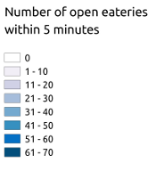

These two animated maps show the accessibility to eateries at
different times of the day and the week, at the University of
California, Santa Barbara and in the adjacent student community of
Isla Vista. The accessibilities are calculated using a simple
cumulative-opportunities measure for opportunities within 5
minutes. Created with
[OpenTripPlanner](http://www.opentripplanner.org). Eatery data
courtesy the
[UCSB Interactive Campus Map](http://map.geog.ucsb.edu). Network data
&copy; [OpenStreetMap](http://www.openstreetmap.org)
Contributors. Colors courtesy
[ColorBrewer](http://colorbrewer2.org). These maps are the result of
a research project and should not be used for decision without
additional consultation.

## Accessibility to eateries by walking

<iframe width="853" height="480" src="https://www.youtube-nocookie.com/embed/jrZURxZrJaU?rel=0" frameborder="0" allowfullscreen="yes"></iframe>

## Accessibility to eateries by cycling

<iframe width="853" height="480" src="https://www.youtube-nocookie.com/embed/PTEvVajxdbc?rel=0" frameborder="0" allowfullscreen="yes"></iframe>

## Legend

